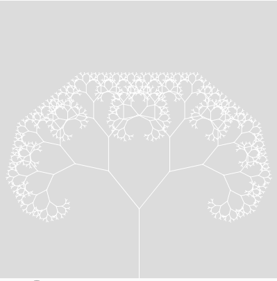
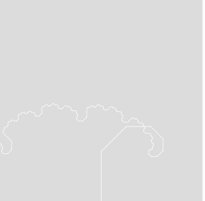

## Introduction

This project has the goal of making a factual tree. From the get-go lets explain what a fractal, well a fractal is an infinite repetition of a certain pattern in this particular case our pattern is the "Y" this may not seem clear now but it will soon don't worry. Now that you know what a fractal is a fractal tree is simply a fractal that makes a tree as its final form. Okay after this basic explanation lets get it started!




at the end of this tutorial, you will obtain the power to make one of these incredible don't you think?

### Setup

#### Web Browser

The method used to access the internet some examples of web browsers:
  
* Google Chrome
* Mozila FireFox
* Microsoft Edge
* Safari
* Opera

And so many others but these are more common

#### Text Editor / Web Editor

So as a writer needs his pen and paper, so you need yours, in your case its an editor, place where magic happens, where you write your code, where you fail, where you sometimes(most of them) rage but most mainly where you succeed so even though its hard to hustle never give up and keep it up, in the long run, it will be worth it. Some examples of text editors are the following:

* [Sublime Text 3](https://www.sublimetext.com/3)
* [Visual Studio Code](https://code.visualstudio.com/)
* [Atom](https://atom.io/)
* [Notepad++](https://notepad-plus-plus.org/download/)

And a milion of others have fun searching for them...

### Basics

For this Project, you will need some acquired knowledge since this tutorial is amazing the knowledge will be given for free

Note:
To define/use functions you need to call them, that's pretty simple here is a small example


```javascript

function whatever() {

}

```

obviously this function does nothing because has nothing inside so lets learn what to put insane to create the factral tree


#### CreateCanvas

Just like in a painting you need some sort of place to be your canvas like the name suggests, insane right? So what do you do to use this function basically do createCanvas next to it in parentheses put first the height followed by the weight obviously with a comma in the middle, finally you have your canvas so let us begin to create art (yeah programming is art).

Note:
fun fact the canvas you just created its height grows to the right like it usually does but its weight doesn't grow upwards like you are used to, it grows to the opposite side or downwards(why does it happen? well that's a challenge for you to overcome) so take it into account when doing your tree.  

Example:

```javascript

function canvas() {
    createCanvas(200,200);
}

```

in this example the canvas has a (200,200) dimension

#### Background

Since a blend canvas is boring and programming is not you need to give it a little bit of life, to do so you use a background that allows editing your canvas color from 0 to 256, being from black to white respectively.

Example:

```javascript

function color() {
    background(0);
}

```

The background is now Black yeah

#### Line

With your "base" set now lets learn how to draw in this case lines,so what do need to draw a line ? exactly two points, so give the function two points (height,weight) and let "line" do its job (unite those points) see as easy as it can be.

Note:
have into account that you need to give one point then another so have into consideration you only have two coordinates you work with so line can only have four arguments (numbers) and three commas

Example:

```javascript

function draw() {
    line(0,0,10,10);
}

```

Here the first point is (0,0) the second one (10,10) and line unifies both

#### Translate

Ever wanted to change the origin of the axis from the good old (0,0) to whatever origin you wanted? well translate make your dreams come true, what's the point you may ask yourself well latter while creating your tree you will understand so take this into account that will help you a lot, to use it up to this point its bread and butter do translate and in parentheses choose new coordinates to its center

Example:

```javascript

function translation() {
    translate(10,10);
}
```

Origin of the axis is now (10,10)

#### Rotate

Almost done with to the Basics and to end it nothing better than rotate that allows you to rotate the axis, the rotation made is made based on the angle given to rotating.

Example:

```javascript

function rotation() {
    rotate(PI/4);
}

```

the axis is rotated now 45 degrees

After this brief knowladge lets finally start coding!

## Start

Since starting line must be somewhere this time is with createCanvas and background (explained before) thats given out even before you even think about it

```javascript

function setup() {
    createCanvas(400, 400);
}

function draw() {
    background(220);
}

```

The "Base" is now ready to improvement so the first step to make the tree happen is to draw its trunk, well to do it lets use line but where should you do it? since canvas size is a 400x400 let do it in the bottom middle of canvas that is 200x200 with 100 lengths and to make it simpler to understand let's make another function with it and call it to branch later will be useful so just make it now

Note:
by creating a new function you must call it on the "main" one, in this case, is "draw" so to call "branch" just go to "draw" and do "branch();"

```javascript

function setup() {
    createCanvas(400, 400);
}

function draw() {
    background(220);
    stroke(255);
    branch();
}

function branch() {
    line(200, 400, 200, 300);
}

```
don't give too much importance to stroke is simply the color desired for the line in this case white

if everything is done correctly it should look like this 


the trunk is now established next step is to draw branches to do so using a variable is optimal, since lots of branches will be needed and to make the tree do it recursively is the way to go so how do you do it? first and foremost to define a variable you do it inside the parentheses of the function you want that variable to be into in this case its branch, let's name it len since it will define the length of branches lets try then to write the same code but now with the variable len

```javascript

function setup() {
    createCanvas(400, 400);
}

function draw() {
    background(220);
    stroke(255);
    branch(100);
}

function branch(len) {
    line(200, 400, 200, 400 - len);
}

```

Note:
when calling branch, 100 is the value of len

using variables is now on skill list but drawing lines from a specific point in this case from (200, 400) to (200, 300) its a pain since the goal is to draw a tree recursively so a simple way to do it is simply starting to draw from the axis origin and then define a pattern so what should you use to do so ? the answer here is translated defining axis origin the middle bottom then starting to make the tree grow from there but by doing this you also need to chance line because it's no more a specific point but the axis origin much easier right?

```javascript

function setup() {
    createCanvas(400, 400);
}

function draw() {
    background(220);
    stroke(255);
    translate(200, 400);
    branch(100);
}

function branch(len) {
    line(0, 0, 0, -len);
}

```

Note:
remenber that axis is inverted so len must be negative thats why its -len

## Development

trunk is fixed and strong to grow big so lets do it, lets draw branches to the tree but going straight ahead its not very treatable, lets go sideways then seems good to do so you need to change the angle you will draw onto, rotate is the way to go but just for testing measures lets only go to the right now that rotate is used there only one thing left before draw the branch what is ? correct moving the axis origin to the trunk's top by using translate again, now all conditions are met let's draw branches

```javascript

function setup() {
    createCanvas(400, 400);
}

function draw() {
    background(220);
    stroke(255);
    translate(200, 400);
    branch(100);
}

function branch(len) {
    line(0, 0, 0, -len);
    translate(0, -len);
    rotate(PI/4);
    line(0, 0, 0, -len);
}

```


your tree now has a new branch, yeah but if you really wanna make a real tree branch as you go up on it will grow smaller so how do you make it possible? simple see how you did line again well that basically doing branch function so instead of doing line just call branch with a smaller value or by other means multiply the initially given number by another smaller than 1 let use 0.7 here

```javascript

function setup() {
    createCanvas(400, 400);
}

function draw() {
    background(220);
    stroke(255);
    translate(200, 400);
    branch(100);
}

function branch(len) {
    line(0, 0, 0, -len);
    translate(0, -len);
    rotate(PI/4);
    branch(len * 0.7);
}

```
surprise it exploded or by other means this happened


well its no surprise there's no limitation/condition to make it stop when it created an infinite loop and eventually went boom,so lets make a stop point so eventually it stops and don't explodes anymore, in order for it to happen use if parentheses and inside the condition you want for branch to stop here lets use len > 4 implement the if condition before with branch inside and it will stop when len is minus or equal to 4 in this case, so lets try it

```javascript

function setup() {
    createCanvas(400, 400);
}

function draw() {
    background(220);
    stroke(255);
    translate(200, 400);
    branch(100);
}

function branch(len) {
    line(0, 0, 0, -len);
    translate(0, -len);
    rotate(PI/4);
    if (len > 4) {
        branch(len * 0.7)
    }
}

```


See it didn't go boom anymore but if you want to adjust the angle without changing it every single time,first lets make the angle a variable so its easier to adjust for so making a slider is the way to go, how do you make a slider you ask use createSlider after in parentheses obviously (take into account that createslider needs four arguments), firstly in the first two arguments you put the slider range here it will be from 0 to 180 (from this point onwards lets stop using radiants and start to use degrees, for it use angleMode(DEGREES), it sets the angle to degrees, if you have difficulties doing so click [here](https://en.wikipedia.org/wiki/Radian)), then on the third argument put the starting point here is 45 and finally how much you want to move by changing the slider 1 seems okay here, so lets implement this to the code

```javascript

let angle;
let slider;

function setup() {
    createCanvas(400, 400);
	  angleMode(DEGREES);
	  slider = createSlider(0, 180, 45, 1);
}

function draw() {
    background(220);
	angle = slider.value();
    stroke(255);
    translate(200, 400);
    branch(100);
}

function branch(len) {
    line(0, 0, 0, -len);
    translate(0, -len);
    rotate(angle);
	if (len > 4) {
      branch(len * 0.7);
}
	
}

```

in case you are wondering ", angle = slider.value();" is simply saying the slider created is applied to the angle range also let is used to define the variable name instead of creating a function easier and most important less work

rightside is now done so to do left side is simply rotating to the opposite side by doing -angle and calling branch again everything on the if condition made before

```javascript

let angle;
let slider;

function setup() {
    createCanvas(400, 400);
	  angleMode(DEGREES);
	  slider = createSlider(0, 180, 45, 1);
}

function draw() {
    background(220);
	angle = slider.value();
    stroke(255);
    translate(200, 400);
    branch(100);
}

function branch(len) {
    line(0, 0, 0, -len);
    translate(0, -len);
    
	if (len > 4) {
      rotate(angle);
      branch(len*0.7);
      rotate(-angle);
      branch(len * 0.7

}
	
}

```


plot twist it doesn't work

## Conclusion

why it seemed so right? well, remember translate it is his fault since you always changed the "starting" point to the top of the branch it doesn't come back to make it to the left side instead goes always right and makes the pattern only there making, a funny but not intended result. To solve this problem is quite easy use push and pop, push saves the initial position that you were before applying the if condition then you do branch like usually and when the if condition makes you stop you pop, it means you go back to the state saved in push, up to this point you have only done the right side of the tree now for the left side just push and pop again but this time to the negative angle and magic will happen

```javascript

let angle;
let slider;

function setup() {
    createCanvas(400, 400);
	  angleMode(DEGREES);
	  slider = createSlider(0, 180, 45, 1);
}

function draw() {
    background(220);
	angle = slider.value();
    stroke(255);
    translate(200, 400);
    branch(100);
}

function branch(len) {
    line(0, 0, 0, -len);
    translate(0, -len);
	if (len > 4) {
    push();
      rotate(angle);
      branch(len*0.7);
    pop();
    push();
      rotate(-angle);
      branch(len * 0.7
    pop();

}
	
}

```


your hard work paid off the tree is finally done this is a basic one now that you have this basic knowledge how to make a fractal tree try to improve it making a Christmas tree or give your imagination/creativity wings and fly create your own and unique tree now that you are up to the challenge go and fly
